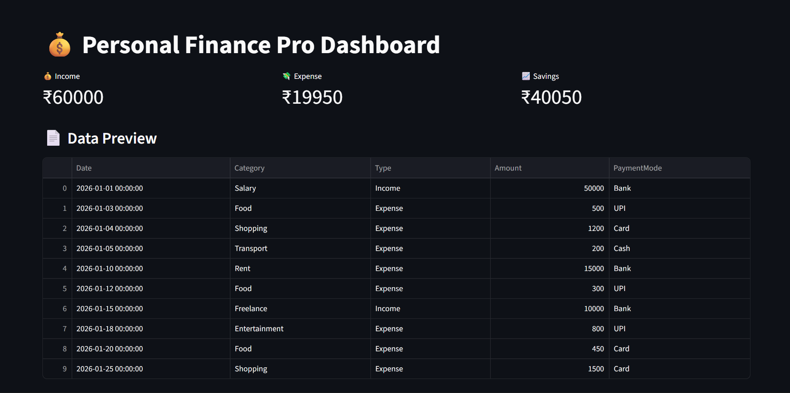
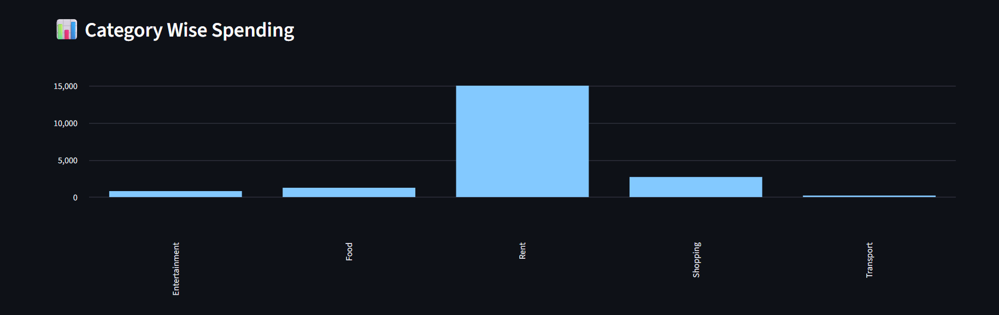
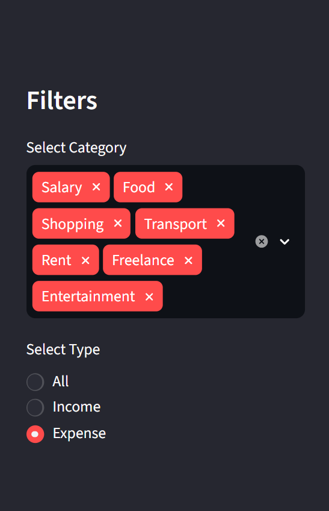

# 💰 Personal Finance Analytics Dashboard

A modern finance analytics dashboard built with **Python**, **Streamlit**, and **Pandas** to help users track expenses, analyze spending patterns, monitor savings, and gain actionable financial insights through interactive visualizations.

## 🚀 Live Demo

🌐 Live App: https://finance-dashboard-saksham.streamlit.app/

---

## 📊 Features

* 📈 Income vs Expense Analysis
* 🧾 Category-wise Spending Breakdown
* 📅 Monthly Spending Trends
* 🎛️ Interactive Filters (Category & Transaction Type)
* 🧠 Automated Financial Insights
* 📊 Interactive Visualizations (Bar, Line & Pie Charts)
* 💡 Easy-to-use Dashboard Interface

---

## 🧰 Tech Stack

| Technology    | Purpose                    |
| ------------- | -------------------------- |
| Python 🐍     | Core Programming Language  |
| Streamlit 🚀  | Dashboard Development      |
| Pandas 📊     | Data Processing & Analysis |
| Matplotlib 📉 | Data Visualization         |

---


## 📁 Project Structure

```text
finance-dashboard/
│
├── .devcontainer/
├── Screenshots/
│   ├── dashboard.png
│   ├── categorywise_spending.png
│   └── filters_sidebar.png
│
├── analysis/
├── data/
├── sql/
├── visuals/
│
├── app.py
├── main.py
├── requirements.txt
├── README.md
└── .gitignore
```

```

---

## ⚙️ Installation

Clone the repository:

```bash
git clone https://github.com/sakshamm2/finance-dashboard-.git
cd finance-dashboard-
```

Install dependencies:

```bash
pip install -r requirements.txt
```

Run the application:

```bash
streamlit run app.py
```

---


## 📸 Dashboard Preview

### Main Dashboard



### Category-wise Spending Analysis



### Interactive Filters



---

## 🎯 Key Insights Generated

* Spending distribution across categories
* Monthly expense trends
* Income vs expense comparison
* Savings analysis
* Financial behavior tracking

---

## 👨‍💻 Author

Saksham Yadav

If you found this project useful, feel free to ⭐ the repository.
